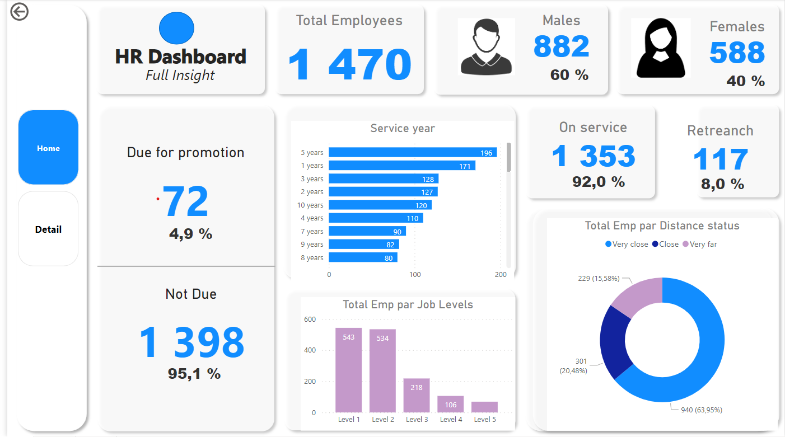
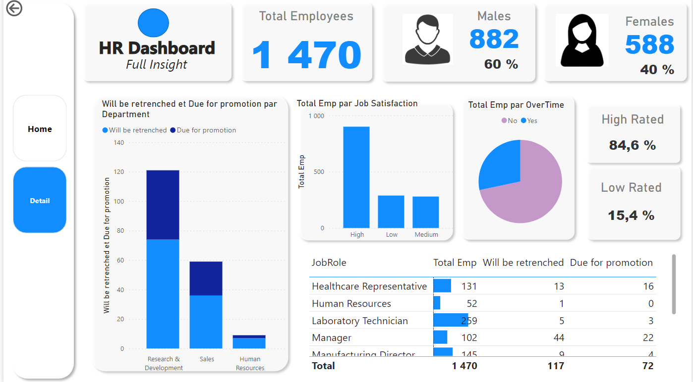
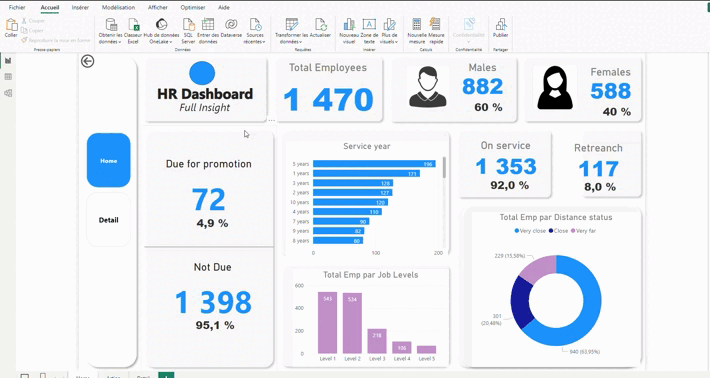

# hr-data-analysis

### 1 - Report Overview

- Satic (Home Page)

- Satic (Detail Page)

- In action:

### 2- Description

In my endeavor to learn **Power BI**, I undertook a guided project aiming at analysing an **Human Ressource (HR)** dataset to generate a comprehensive report. The resulting dashboard offers a summary of various metrics, encompassing:

- **Total employee** of the company ( Male and Female)
- How many employees are due for promotion or not
- Employees that can be retrenched if the company planned to.
- Job Satisfaction status of employees

### 3- Key Takeaways

Going through this guided project, I've learned useful Power BI concepts such as:

- Importing and transforming datas using DAX
- Merging data from `two or more` **CSV files**.
- Creating measure
- **Grouping measures** into table mesure
- Customising visualizations
- Creating **Navigation menu** in order to move between dashboard pages

### 4- Credits:

The guided project was created by **Ismaila Omeiza Mumuni** through his youtube channel` named [Data and Decision](https://m.youtube.com/watch?v=7EEGhZb2WKY). I'd like to extent my gratitude to him for his valuable content that help me. 
